Flights at ABIA
---------------

We used the data corresponding to all departures from the
Austin/Bergstrom Airport in 2008 to create a set 12 of heat maps, one
for each month of the year that depict the average departure delays(in
hours) by aircraft carrier and day of the week.

These charts can help us to get a sense of which aircraft carriers are
most delayed on each day of the week for every month. We can also
observe how delay patterns changed over the year.

    ABIA=read.csv('ABIA.csv')
    ABIA_dep=ABIA[ABIA$Origin=='AUS',]
    ABIA_dep_df=tbl_df(ABIA_dep)
    ABIA_dep$DayOfWeek=as.factor(ABIA_dep$DayOfWeek)
    ABIA_dep$DayOfWeek =revalue(ABIA_dep$DayOfWeek ,c("1"="Mon","2"="Tue","3"="Wed","4"="Thurs","5"="Fri","6"="Sat","7"="Sun"))
    ABIA_dep$Month=as.factor(ABIA_dep$Month)
    ABIA_dep$Month =revalue(ABIA_dep$Month ,c("1"="January","2"="February","3"="March","4"="April","5"="May","6"="June","7"="July",
        "8"="August","9"="September","10"="October","11"="November","12"="December"))

    color=colorRampPalette(c('white','red'))
    for (month in levels(ABIA_dep$Month)){
                        ABIA_dep_month=ABIA_dep[ABIA_dep$Month==month,]
                        ABIA_dep_df=tbl_df(ABIA_dep_month)
                        carrier=group_by(ABIA_dep_df,UniqueCarrier, DayOfWeek)
                        carrier_delay = summarize(carrier, delay = mean(DepDelay, na.rm = TRUE))
                        carrier_de=cast(carrier_delay, UniqueCarrier~DayOfWeek)
                        heatmap.2(as.matrix(carrier_de),Rowv=NA, Colv=NA,na.rm=TRUE,main=month,col=color,trace='none')
                        cat("\n\n\n\n\n")
                        }

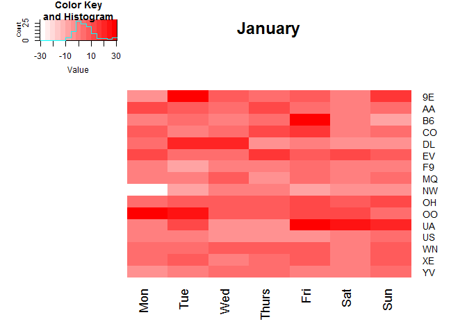

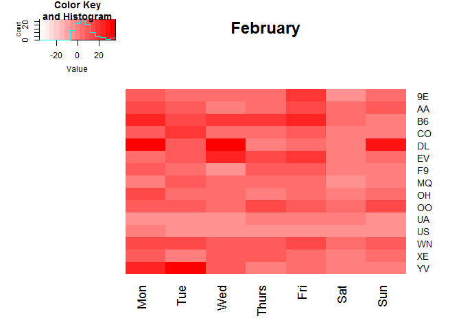

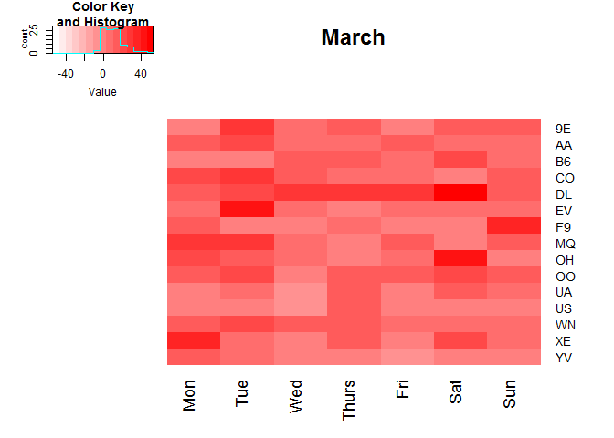

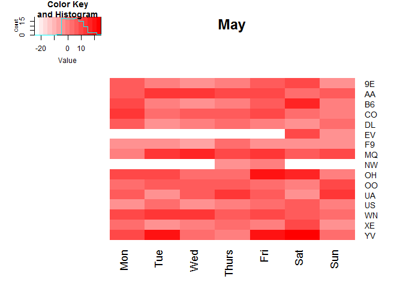

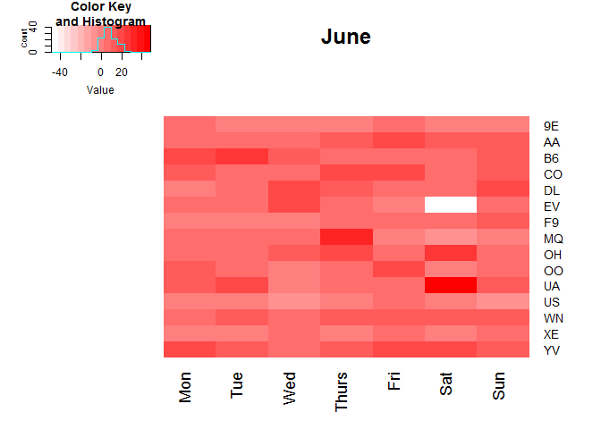

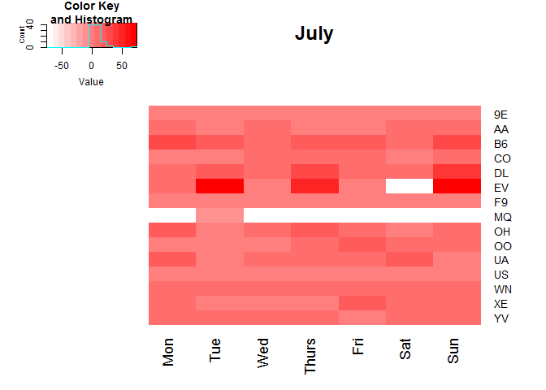

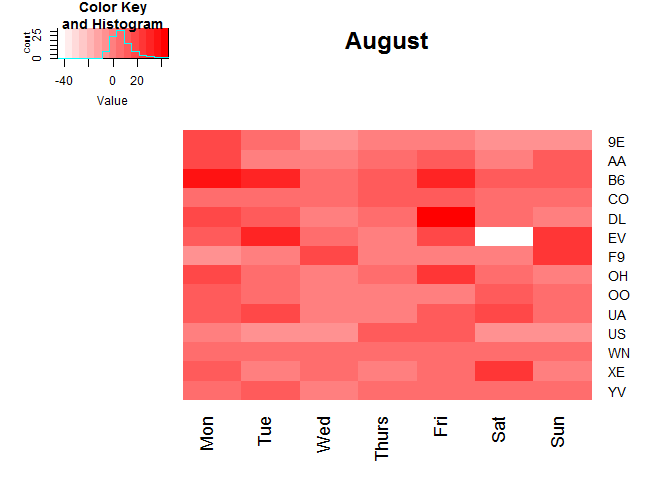

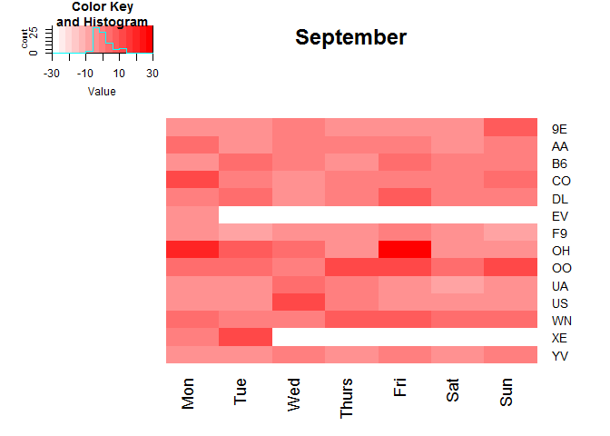

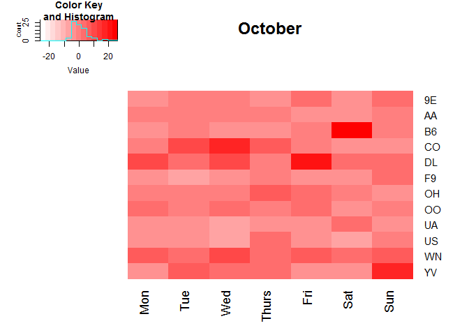

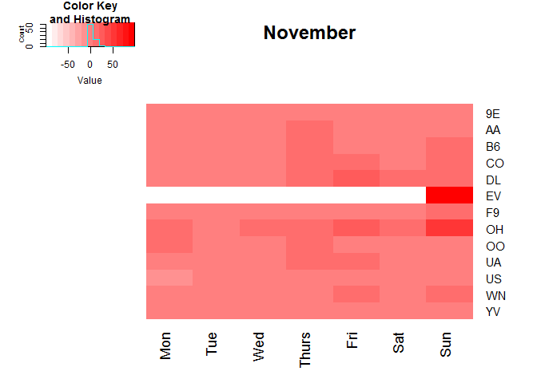

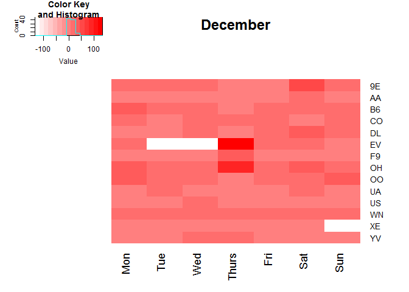

White cells represent no flights relevant to that particular cell.

These heat maps make interpretations on a month by month basis easy.
April appears to be the best month to travel across the board,
regardless of the day of the week, to minimize delays. The summer months
of June,July, and August have a higher rate of delays perhaps because of
the increased passenger traffic.

Finally, there does not appear to be a consistently delay prone airline.
It seems stochastic over all the visualizations. \#\#Author Attribution

### Pre-Processing

First, we obtain all authors in the training set

    allAuthorsInTrainingSet = list.files("ReutersC50/c50train")

Copy *readerPlain* helper function and read libraries

    library(tm)

    ## Warning: package 'tm' was built under R version 3.4.1

    ## Loading required package: NLP

    ## Warning: package 'NLP' was built under R version 3.4.1

    ## 
    ## Attaching package: 'NLP'

    ## The following object is masked from 'package:ggplot2':
    ## 
    ##     annotate

    library(magrittr)

    ## Warning: package 'magrittr' was built under R version 3.4.1

    readerPlain = function(fname){
                    readPlain(elem=list(content=readLines(fname)), 
                                id=fname, language='en') }

Next, iterate through all training authors to create corpus

    library(foreach)

    ## Warning: package 'foreach' was built under R version 3.4.1

    l = foreach( i = 1:length(allAuthorsInTrainingSet),.combine = 'c') %do% {
      author = allAuthorsInTrainingSet[i]
      fpath = paste("ReutersC50/c50train/",author,"/*.txt",sep = "")
      file_list = Sys.glob(fpath)
      current = lapply(file_list,readerPlain)
      mynames = file_list %>%
        { strsplit(., '/', fixed=TRUE) } %>%
        { lapply(., tail, n=2) } %>%
        { lapply(., paste0, collapse = '') } %>%
        unlist
      current
    }
    trainingCorpus = Corpus(VectorSource(l))

Perform data cleaning

    trainingCorpus = tm_map(trainingCorpus, content_transformer(tolower)) # make everything lowercase
    trainingCorpus = tm_map(trainingCorpus, content_transformer(removeNumbers)) # remove numbers
    trainingCorpus = tm_map(trainingCorpus, content_transformer(removePunctuation)) # remove punctuation
    trainingCorpus = tm_map(trainingCorpus, content_transformer(stripWhitespace))
    trainingCorpus = tm_map(trainingCorpus,content_transformer(removeWords),stopwords("en"))

Perform similar operations with test set

    allAuthorsInTestSet = list.files("ReutersC50/c50test")
    l = foreach( i = 1:length(allAuthorsInTrainingSet),.combine = 'c') %do% {
      author = allAuthorsInTestSet[i]
      fpath = paste("ReutersC50/c50test/",author,"/*.txt",sep = "")
      file_list = Sys.glob(fpath)
      current = lapply(file_list,readerPlain)
      mynames = file_list %>%
        { strsplit(., '/', fixed=TRUE) } %>%
        { lapply(., tail, n=2) } %>%
        { lapply(., paste0, collapse = '') } %>%
        unlist
      current
    }
    testCorpus = Corpus(VectorSource(l))
    testCorpus = tm_map(testCorpus,content_transformer(removeWords),stopwords("en"))
    #testWithoutEN = tm_map(testCorpus,content_transformer(removeWords),stopwords("en"))

Using the Corpus, construct a Document Term Matrix object with Term
Frequency - Inverse Document Frequency scores

    #construct Document Term Matrix and convert to TF-IDF
    DTMTrainSimple = DocumentTermMatrix(trainingCorpus,control = list(weighting = function(x) weightTfIdf(x)))

Finally, drop all the sparse terms from the Document term matrix.

    dropTermPercent = .95
    DTMTrainSimple = removeSparseTerms(DTMTrainSimple,dropTermPercent)

### Principle Component Analysis

Run PCA on Training Data

    pcaTrainSimple = prcomp(DTMTrainSimple,scale = TRUE)

Plot variance for each number of Principle Components:

    par(bg = "gray")
    plot(pcaTrainSimple$sdev^2,type = "l",main = "Projection Error for number of Principle Components",col = "blue",xlab = "Number of Principal Components",ylab = "Projection Error (Variance)")
    bestComponents = 150
    abline(v = bestComponents ,lw = 2,col = "red")

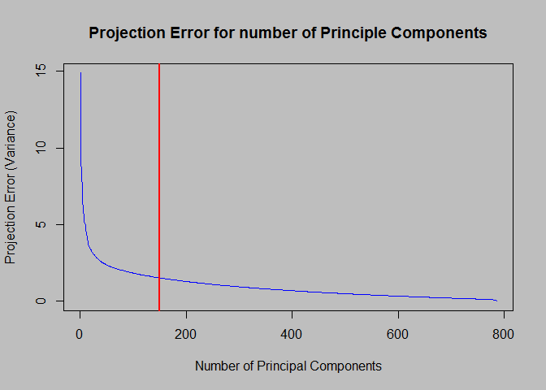

### Finishing up Latent Semantic Analysis

Next, construct your Document Vectors by applying Principal Components

    x = as.matrix(DTMTrainSimple)
    V = t(t(pcaTrainSimple$rotation)[1:bestComponents,])
    x = x %*% V

As a final part of training set pre-processing, construct your response
vector:

    response = sort(rep(allAuthorsInTrainingSet,50))

Format your test set:

    testCorpus = tm_map(testCorpus, content_transformer(tolower)) # make everything lowercase
    testCorpus = tm_map(testCorpus, content_transformer(removeNumbers)) # remove numbers
    testCorpus = tm_map(testCorpus, content_transformer(removePunctuation)) # remove punctuation
    testCorpus = tm_map(testCorpus, content_transformer(stripWhitespace))

Turn Test Corpus into DTM matrix:

    DTMTestSet = DocumentTermMatrix(testCorpus,control = list(weighting = function(x) weightTfIdf(x)))

Apply the training set's PCA:

    pcaTest = predict(pcaTrainSimple,newdata = DTMTestSet)
    testX = pcaTest[,1:bestComponents]

Create test set response (same as training set response because of
directory file structure) and create classification rate function

    testResponse = response

    getClassificationRate = function(model,testX,testY){
      pred = predict(model,data.frame(testX))
      sum(pred == testY)/length(pred)
    }

### First Model: Naive Bayes

    library(naivebayes)

    ## Warning: package 'naivebayes' was built under R version 3.4.1

    nb = naive_bayes(x = x, y= as.factor(response))
    getClassificationRate(nb,testX,testResponse)

    ## [1] 0.0212

### Second Model: Ensemable Decision Trees: Bagging

Decision Tree Bagging

    library(randomForest)

    ## Warning: package 'randomForest' was built under R version 3.4.1

    ## randomForest 4.6-12

    ## Type rfNews() to see new features/changes/bug fixes.

    ## 
    ## Attaching package: 'randomForest'

    ## The following object is masked from 'package:ggplot2':
    ## 
    ##     margin

    ## The following object is masked from 'package:dplyr':
    ## 
    ##     combine

    library(doParallel)

    ## Warning: package 'doParallel' was built under R version 3.4.1

    ## Loading required package: iterators

    ## Loading required package: parallel

    registerDoParallel(cores = 6)
    testTrees = c(1,2,5,10,20,40,60,100,120,180,200)
    bagClass = foreach( i = 1:length(testTrees),.combine = 'c') %dopar%
    {
        bag = randomForest::randomForest(as.factor(response) ~.,data = data.frame(x),mtry =bestComponents,ntree = testTrees[i])
        getClassificationRate(bag,testX,testResponse)  
    }

Plot the outcome of Bagging

    par(bg = "gray")
    plot(testTrees,bagClass,type = "l", col = "red",main = "Bagging in Decision Trees: Classification Rate vs Number of Trees",xlab = "Number of Trees",ylab = "Classification Rate")

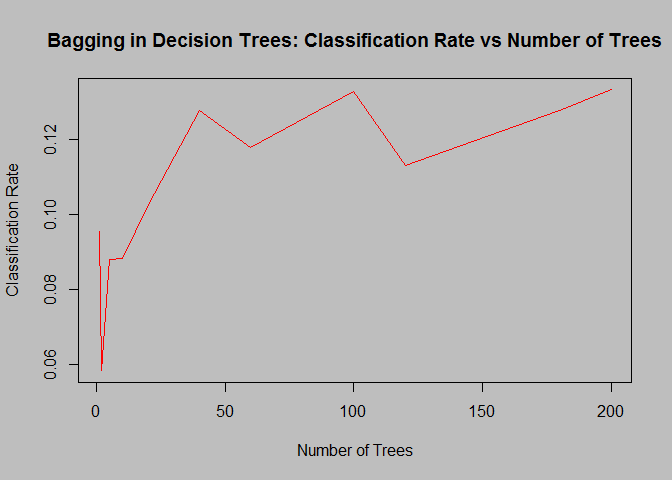

    print(paste("Best Out-of-Sample Classification Rate: ", max(bagClass)))

    ## [1] "Best Out-of-Sample Classification Rate:  0.1332"

This is still a very low classification rate. Let's try a Gradient
Boosted Tree model

### Third Model: Ensemble Decision Tree: Gradient Boosting

    library(gbm)

    ## Warning: package 'gbm' was built under R version 3.4.1

    ## Loading required package: survival

    ## Loading required package: lattice

    ## Loading required package: splines

    ## Loaded gbm 2.1.3

    boost = gbm::gbm(as.factor(response)~.,data = data.frame(x),n.trees = 100,shrinkage = .01,interaction.depth = 3)

    ## Distribution not specified, assuming multinomial ...

    pred = predict(boost,data.frame(testX),n.trees = 50)
    pred = colnames(pred)[apply(data.frame(pred),1,which.max)]
    sum(pred == testResponse)/length(testResponse)

    ## [1] 0.2412

Boosting works better than Random Forest or Bagging and Naive Bayes.
Yet, there is still a relatively low classification rate. This author
attribution task was very difficult for these models. While this model
does perform well over the baseline of 2%, there is plenty of room for
improvement.

Using boosting as our model going forward, let's take a look at this
model's predictions per author.

    library(dplyr)
    authorClassification = data.frame(pred) %>% group_by(pred) %>% summarise(count = n()) %>% arrange(desc(count))

The boosted model was over predicting authors:

    authorClassification[1:5,]

    ## # A tibble: 5 x 2
    ##             pred count
    ##           <fctr> <int>
    ## 1  AaronPressman   196
    ## 2   JonathanBirt   146
    ## 3 JoWinterbottom   144
    ## 4 AlexanderSmith   132
    ## 5   WilliamKazer   110

And under predicting authors:

    authorClassification[(nrow(authorClassification)-5):nrow(authorClassification),]

    ## # A tibble: 6 x 2
    ##              pred count
    ##            <fctr> <int>
    ## 1 LynnleyBrowning    11
    ## 2       NickLouth     6
    ## 3     SamuelPerry     3
    ## 4 BenjaminKangLim     2
    ## 5   JaneMacartney     2
    ## 6   PeterHumphrey     2

### Author Attribution Next Steps

Given more time, the next step would be to apply more sophisticated and
specialized Natural Language Processing strategies like Support Vector
Machines or Latent Dirichlet Allocation. We would expect those
techniques to work better, although the tree methods provide a solid
baseline for how well author attribution could work on this Corpus.

Association Rule Mining
-----------------------

    library(arules)

    ## Warning: package 'arules' was built under R version 3.4.1

    ## Loading required package: Matrix

    ## 
    ## Attaching package: 'Matrix'

    ## The following object is masked from 'package:reshape':
    ## 
    ##     expand

    ## 
    ## Attaching package: 'arules'

    ## The following object is masked from 'package:tm':
    ## 
    ##     inspect

    ## The following object is masked from 'package:dplyr':
    ## 
    ##     recode

    ## The following objects are masked from 'package:base':
    ## 
    ##     abbreviate, write

### Preprocess and Initial Run

First, import data set using 'read.transactions'. This function let's
you import the data set in the format which 'arules' can use

    groceries = read.transactions('https://raw.githubusercontent.com/jgscott/STA380/master/data/groceries.txt', format = 'basket', sep = ',', rm.duplicates = FALSE)

Next, run the apriori algorithm on the data set to generate association
rules. Initially run the algorithm with low values for the 'Support' and
'Confidence' and check the rules generated:

    groc_rules <- apriori(groceries, parameter=list(support=.01, confidence=.5, maxlen=10))

    ## Apriori
    ## 
    ## Parameter specification:
    ##  confidence minval smax arem  aval originalSupport maxtime support minlen
    ##         0.5    0.1    1 none FALSE            TRUE       5    0.01      1
    ##  maxlen target   ext
    ##      10  rules FALSE
    ## 
    ## Algorithmic control:
    ##  filter tree heap memopt load sort verbose
    ##     0.1 TRUE TRUE  FALSE TRUE    2    TRUE
    ## 
    ## Absolute minimum support count: 98 
    ## 
    ## set item appearances ...[0 item(s)] done [0.00s].
    ## set transactions ...[169 item(s), 9835 transaction(s)] done [0.00s].
    ## sorting and recoding items ... [88 item(s)] done [0.00s].
    ## creating transaction tree ... done [0.00s].
    ## checking subsets of size 1 2 3 4 done [0.00s].
    ## writing ... [15 rule(s)] done [0.00s].
    ## creating S4 object  ... done [0.00s].

    inspect(subset(groc_rules, subset=lift > 2))

    ##      lhs                     rhs                   support confidence     lift
    ## [1]  {curd,                                                                   
    ##       yogurt}             => {whole milk}       0.01006609  0.5823529 2.279125
    ## [2]  {butter,                                                                 
    ##       other vegetables}   => {whole milk}       0.01148958  0.5736041 2.244885
    ## [3]  {domestic eggs,                                                          
    ##       other vegetables}   => {whole milk}       0.01230300  0.5525114 2.162336
    ## [4]  {whipped/sour cream,                                                     
    ##       yogurt}             => {whole milk}       0.01087951  0.5245098 2.052747
    ## [5]  {other vegetables,                                                       
    ##       pip fruit}          => {whole milk}       0.01352313  0.5175097 2.025351
    ## [6]  {citrus fruit,                                                           
    ##       root vegetables}    => {other vegetables} 0.01037112  0.5862069 3.029608
    ## [7]  {root vegetables,                                                        
    ##       tropical fruit}     => {other vegetables} 0.01230300  0.5845411 3.020999
    ## [8]  {root vegetables,                                                        
    ##       tropical fruit}     => {whole milk}       0.01199797  0.5700483 2.230969
    ## [9]  {tropical fruit,                                                         
    ##       yogurt}             => {whole milk}       0.01514997  0.5173611 2.024770
    ## [10] {root vegetables,                                                        
    ##       yogurt}             => {other vegetables} 0.01291307  0.5000000 2.584078
    ## [11] {root vegetables,                                                        
    ##       yogurt}             => {whole milk}       0.01453991  0.5629921 2.203354
    ## [12] {rolls/buns,                                                             
    ##       root vegetables}    => {other vegetables} 0.01220132  0.5020921 2.594890
    ## [13] {rolls/buns,                                                             
    ##       root vegetables}    => {whole milk}       0.01270971  0.5230126 2.046888
    ## [14] {other vegetables,                                                       
    ##       yogurt}             => {whole milk}       0.02226741  0.5128806 2.007235

The 14 rules generated here are the set of all possible association
rules which have a support and confidence greater than the thresholds
provided.

### Find Power Association Rules

Create subsets of these association rules by altering the 'support',
'confidence' and 'lift' parameters and observing which association rules
are filtered out. As 'Lift' is the increase in probability of the
"consequent" item set given the "if" (antecedent) item set, higher the
Lift, stronger is the association between the two item sets in the
association rule. To filter out only the strong association rules we can
subset for those rules which have high Lift

In this example, no rules have a lift greater than 3.5. Set the lift
threshold to 3.0.

    inspect(subset(groc_rules, subset=lift > 3))

    ##     lhs                  rhs                   support confidence     lift
    ## [1] {citrus fruit,                                                        
    ##      root vegetables} => {other vegetables} 0.01037112  0.5862069 3.029608
    ## [2] {root vegetables,                                                     
    ##      tropical fruit}  => {other vegetables} 0.01230300  0.5845411 3.020999

There is a trade off present with this 'Lift' threshold. We could get
rules with a Lift greater than 3 but we would have to reduce the minimum
'Support' thresholds. This would give us rules where the association is
stronger but, because 'Support' is low for them, the count of item sets
that show up in these rules are too low to be considered significant
from a sales perspective.

Similarly, getting high values of 'Lift' when 'Confidence' is low does
not help, because this happens only when 'Expected Confidence' is also
low. Such item sets and the resultant association rules which have low
'Expected Confidence' face significance problems just like low 'Support'
rules.

    inspect(subset(groc_rules, subset=confidence > 0.58))

    ##     lhs                  rhs                   support confidence     lift
    ## [1] {curd,                                                                
    ##      yogurt}          => {whole milk}       0.01006609  0.5823529 2.279125
    ## [2] {citrus fruit,                                                        
    ##      root vegetables} => {other vegetables} 0.01037112  0.5862069 3.029608
    ## [3] {root vegetables,                                                     
    ##      tropical fruit}  => {other vegetables} 0.01230300  0.5845411 3.020999

The discovered relationships are reasonable. Dairy product are
associated in Item 1 and Fruits/Vegetables are associated in Items 2 and
3. This relationships makes sense not only because of typical geography
of a grocery store (Dairy Products together and Fruits/Vegetables
together), but also the types of people who would purchase those
groceries.

Most powerful association rule:

    inspect(subset(groc_rules, subset=support > .011 & confidence > 0.58 & lift>3))

    ##     lhs                  rhs                 support confidence     lift
    ## [1] {root vegetables,                                                   
    ##      tropical fruit}  => {other vegetables} 0.012303  0.5845411 3.020999
